# TableDrawer · 图表绘制与矩阵计算工作台

一个基于 **PySide6 + Matplotlib + Pandas + NumPy** 的桌面应用：读数据 → 画图 → 算矩阵，
所有数学结果都用 **LaTeX** 排版渲染。

图表可导出为 **SVG / PNG / PDF / PGF-TikZ**，也可以一键导出**可独立运行的 matplotlib
Python 源码**；矩阵与向量组计算覆盖转置、求逆、行列式、特征值、秩、分解、范数等 55 项运算。

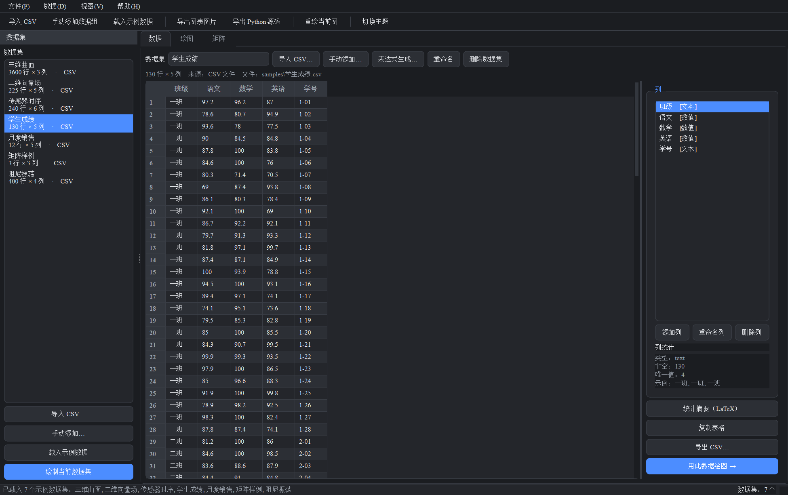

---

## 目录

- [功能一览](#功能一览)
- [快速开始](#快速开始)
- [界面预览](#界面预览)
- [使用说明](#使用说明)
  - [1. 准备数据](#1-准备数据)
  - [2. 绘图](#2-绘图)
  - [3. 导出](#3-导出)
  - [4. 矩阵与向量组计算](#4-矩阵与向量组计算)
- [项目结构](#项目结构)
- [技术说明](#技术说明)
  - [为什么要自己写 LaTeX 排版引擎](#为什么要自己写-latex-排版引擎)
  - [字体与中文](#字体与中文)
- [测试](#测试)
- [常见问题](#常见问题)

---

## 功能一览

| 模块 | 能力 |
| --- | --- |
| **数据** | 智能读取 CSV（自动探测编码 / 分隔符 / 表头，带实时预览）、手动录入（表格编辑 + Excel 粘贴）、NumPy 表达式派生与生成、列增删改名、描述性统计与相关系数矩阵 |
| **图表** | 二维 14 种 + 三维 8 种；多序列叠加、多列一次成图、$LaTeX$ 公式标题、9 种主题、明/暗双色板 |
| **矩阵输入** | 内嵌小表格 + **放大/全屏编辑窗口**、表格**自动扩展**（可一直往下填）、结束自动识别有效区域、空白单元格填充策略可选（0 / 1 / NaN / 向左复制 / 行内插值 / 报错）、**LaTeX 实时预览** |
| **导出** | SVG（矢量）/ PNG / PDF / PGF-TikZ / JPEG；**独立可运行的 Python 源码**（数据可内联或从 CSV 读）；绘图配置 JSON |
| **manim 动画** | 把**计算过程**导出成 manim 动画：6 种场景、**分镜预览**（不用装 manim 也能看）、可直接运行的 manim 源码、装了 manim 可一键渲染成 MP4 |
| **矩阵运算** | 55 项运算，10 个分组：生成矩阵、基本运算、矩阵乘法、行列式与秩、逆与广义逆、特征值与特征向量、矩阵分解、范数与条件数、线性方程组、向量组 |
| **渲染** | 界面上的数学符号（`Aᵀ`、`A⁻¹`、`λᵢ`、`‖A‖`…）全部由自研 LaTeX 引擎排版成矢量位图；**批量渲染 + 磁盘缓存，第二次启动瞬间显示** |
| **字体** | 可切换字体预设，默认 **英文 Times New Roman / 中文宋体 / 代码 Consolas**；逐字符字体回退，中文与公式在同一行也能正确混排 |

**二维图表**：折线、散点、柱形、条形、火柴杆、阶梯、面积填充、误差棒、直方图、箱线图、
饼图、**向量图（quiver）**、等高线、热力图

**三维图表**：三维折线、三维散点、曲面、线框、三维柱形、**三维向量场**、三维等高线、三角剖分曲面

---

## 快速开始

```bash
# 1. 安装依赖（已在本仓库的 .venv 中验证：Python 3.14 / PySide6 6.11 / matplotlib 3.11 / pandas 3.0 / numpy 2.5）
python -m pip install -r requirements.txt

# 2. 启动
python app.py

# 也可以直接带上 CSV 文件启动，或指定主题
python app.py samples/传感器时序.csv --theme light
```

Windows 下可直接双击 `run.bat`（会自动优先使用 `.venv` 里的解释器）。

首次使用建议点「文件 → 载入示例数据」，会一次性载入 `samples/` 下的 7 个示例 CSV。

---

## 界面预览

| 绘图（二维） | 绘图（三维曲面） |
| --- | --- |
| 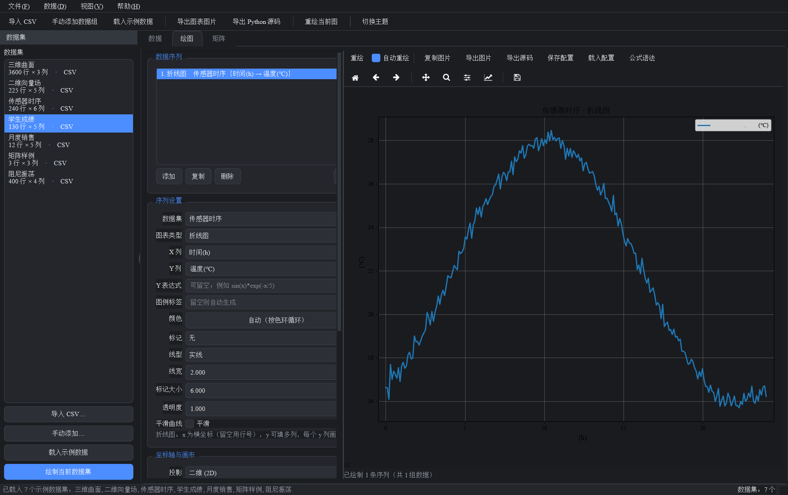 | 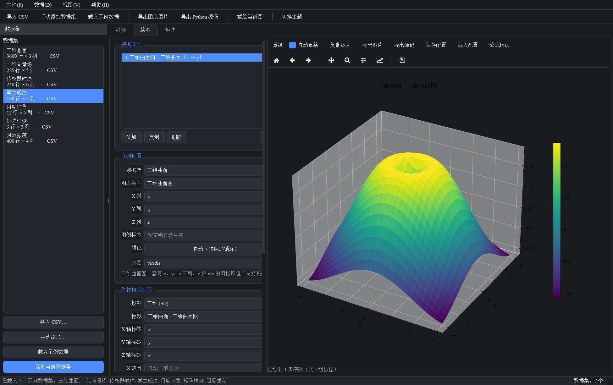 |

| 矩阵与向量组计算（结果用 LaTeX 渲染） | 放大编辑矩阵（自动扩展 + 填充策略 + 实时预览） |
| --- | --- |
| 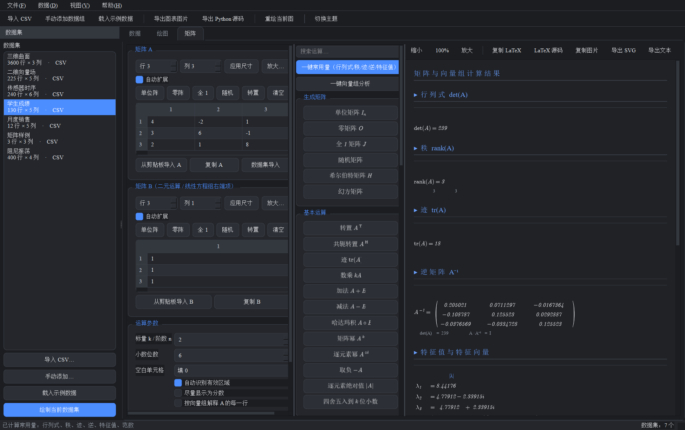 | 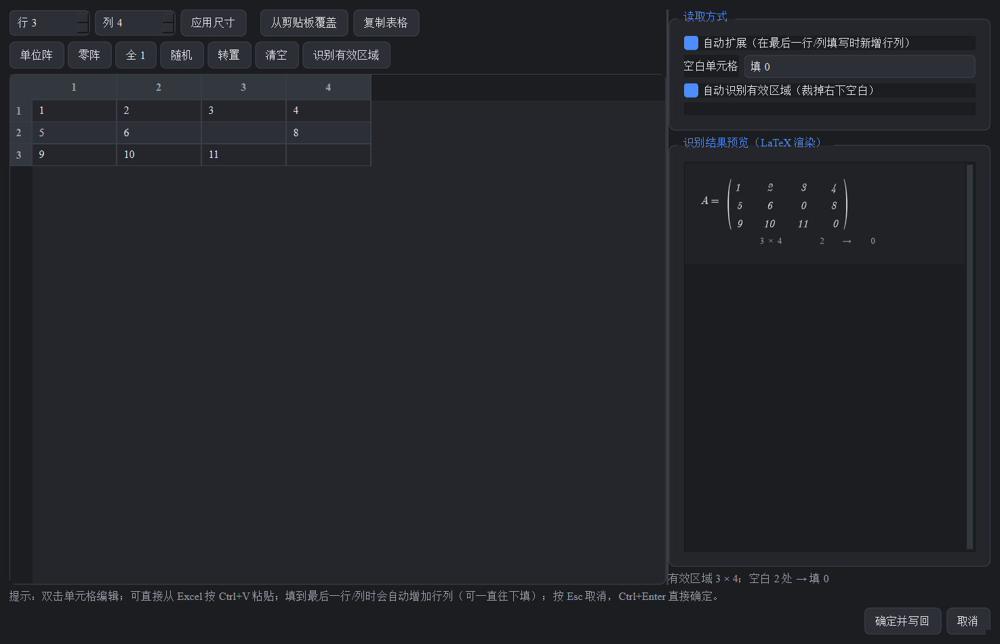 |

| manim 分镜预览（无需安装 manim） | manim 源码（可直接运行） |
| --- | --- |
| 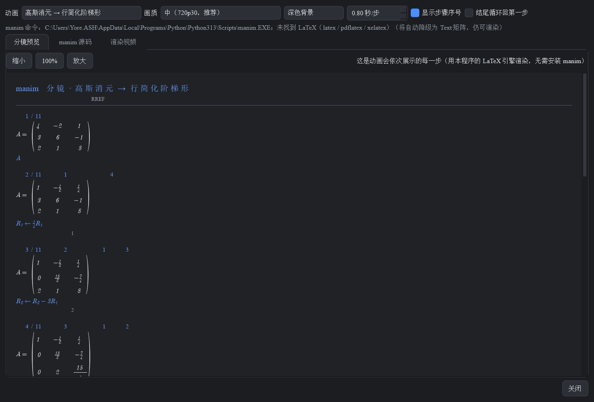 | 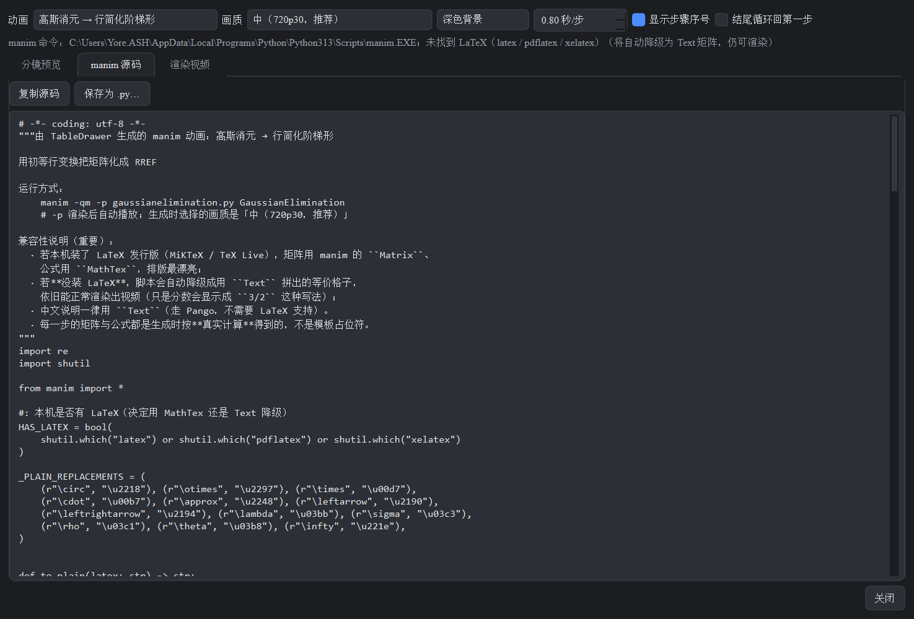 |

| 中文与公式混排的标题 / 轴标签 | 浅色主题 |
| --- | --- |
| 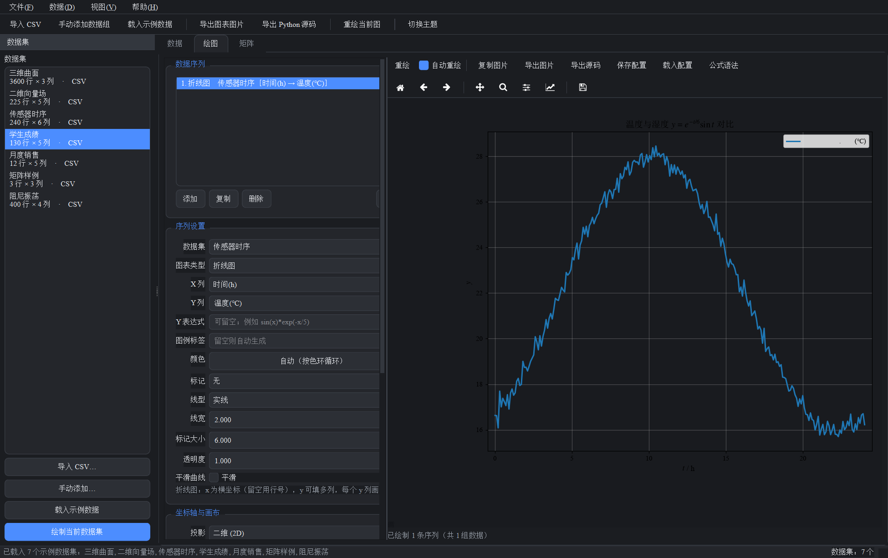 | 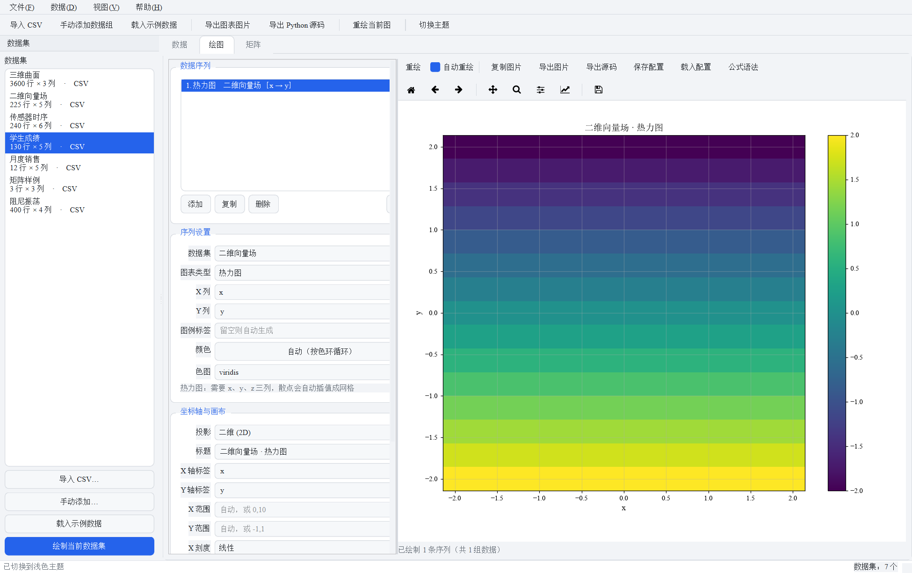 |

| CSV 导入（自动探测 + 实时预览） | 导出 Python 源码 |
| --- | --- |
| 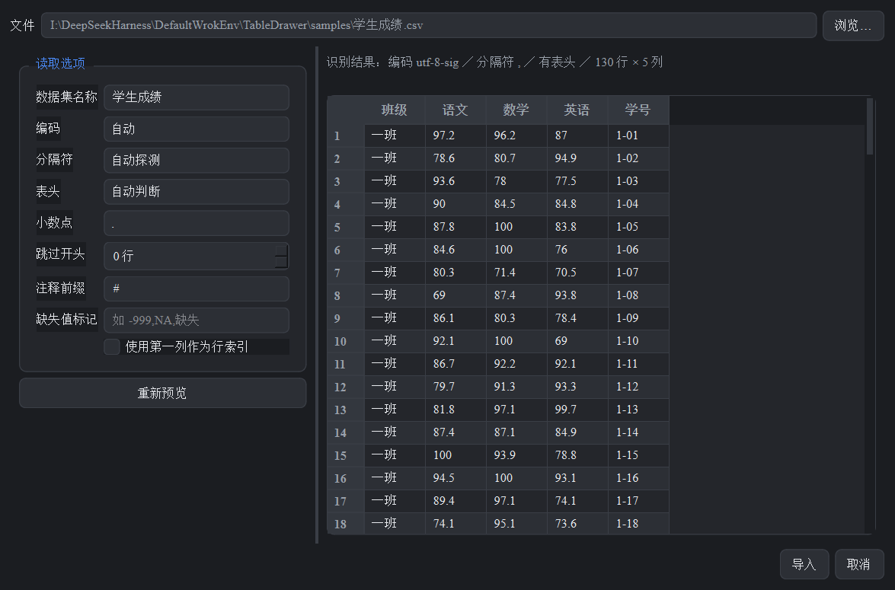 | 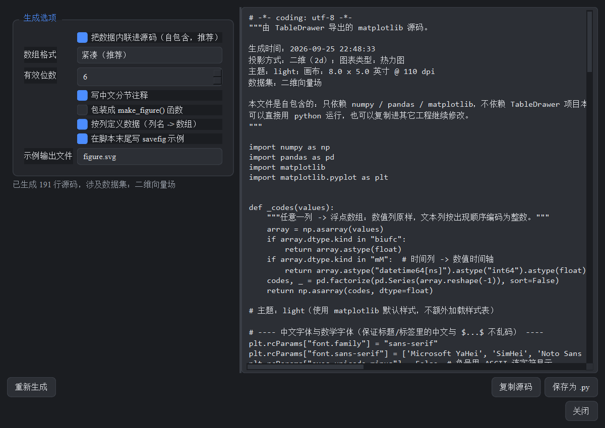 |

---

## 使用说明

### 1. 准备数据

三条途径，可以混用：

1. **导入 CSV** —— 「文件 → 导入 CSV…」，或把 `.csv` 文件**直接拖进窗口**，或用
   `python app.py a.csv b.csv`。
   导入对话框会自动识别编码（UTF-8 / UTF-8-BOM / GB18030 / Big5 …）、分隔符
   （逗号 / 分号 / Tab / 竖线 / 空格）、是否有表头，并在右侧实时预览；
   任何一项都可以手动覆盖，还能设置小数点符号、跳过行数、注释前缀、缺失值标记。
2. **手动添加数据组** —— 「文件 → 手动添加数据组…」。
   - 「表格录入」页：双击单元格编辑，也能从 Excel 复制后 `Ctrl+V` 整块粘贴。
   - 「文本粘贴」页：直接粘贴整段 CSV/TSV 文本，一键解析成表格。
3. **表达式生成** —— 「数据 → 表达式生成数据…」。
   - *派生新列*：在已有数据集上按表达式加一列，例如 `sin(x) * exp(-x/5)`。
   - *新建数据集*：自定义数据点数 `n`，逐列写表达式，例如
     `x = linspace(0, 2*pi, n)`、`y = sin(x)`、`z = cos(x)*exp(-x/5)`。

   可用变量：`x`（首列或所选 X 列）、`t` / `i`（行号）、`n`（行数）以及任意数值列名；
   可用函数：`sin cos tan exp log log10 sqrt abs power sign clip where linspace arange
   cumsum diff gradient mean std sum min max nan_to_num` 与常量 `pi e`。
   表达式在受限命名空间中求值，`__import__`、`open`、`import` 等一律拒绝。

数据页右侧还能查看每列的统计量、增删改列、把表格复制为 Tab 分隔文本、导出 CSV，
以及用 LaTeX 表格渲染**描述性统计**和**相关系数矩阵**。

### 2. 绘图

在绘图页左侧操作：

1. 「数据序列」区点「添加」，或直接在左侧「数据集」侧栏点「绘制当前数据集」自动生成默认图。
2. **序列设置**：选数据集与图表类型，指定各列：
   - `X 列` 留空 = 用行号；`Y 列` **可以填多列**（英文逗号分隔），一次画多条；
   - 三维图填 `Z 列`；向量图填 `U`、`V`（三维再加 `W`）分量；
   - `Y 表达式` 可以用公式临时派生 Y，例如 `sin(x)*exp(-x/5)`；
   - 其余外观（标记、线型、线宽、颜色、透明度、柱宽、分箱数、等高线层数、箭头缩放……）
     会随图表类型自动显示/隐藏，每种类型都有中文提示说明需要哪些列。
3. **坐标轴与画布**：标题、轴标签、范围、刻度类型（线性/对数/对称对数/Logit）、
   网格、图例及其位置、等比例、色条、三维俯仰角/方位角、主题、画布尺寸与 DPI。
   标题与轴标签支持 $LaTeX$ 公式，如 `$y = e^{-x^2}$`（点「公式语法」看可用命令）。
4. 序列可上移/下移/复制/删除，多条序列叠加在同一张图上。
5. 画布下方会显示缺列等中文警告；工具条支持缩放、平移与保存视图。

### 3. 导出

- **导出图片…**：SVG（矢量，推荐用于论文/报告）、PNG、PDF、PGF/TikZ、JPEG。
- **导出源码…**：生成一段**自包含、可直接 `python xxx.py` 运行**的 matplotlib 源码。
  可选项：数据内联进源码 / 改为从 CSV 读取、数组格式（紧凑或每行一个数）、
  有效位数、中文分节注释、包装成 `make_figure()` 函数、末尾 `savefig` 示例。
  生成结果可复制到剪贴板或保存为 `.py`。
- **复制图片** 直接把当前图以 150 dpi 位图放进剪贴板。
- **保存配置 / 载入配置** 把整份绘图设置存成 JSON，方便复用。

### 4. 矩阵与向量组计算

1. 在「矩阵」页输入矩阵 **A**（二元运算还需要 **B**，部分运算需要标量 `k` 或阶数 `n`）。
   - 单元格支持从 Excel / 文本粘贴；「单位阵 / 零阵 / 全 1 / 随机 / 转置」一键填充；
   - 「从数据集列导入…」可以把数据集的若干数值列直接变成矩阵；
   - 勾选「按向量组解释 A 的每一行」后，A 的每一行被当作一个向量。

2. **填一个大矩阵：点「放大编辑…」（或「放大编辑矩阵 A…」）**
   打开独立的大窗口，可以最大化甚至全屏，专门用来舒服地填矩阵：

   | 能力 | 说明 |
   | --- | --- |
   | **自动扩展** | 在最后一行 / 最后一列填写内容时自动追加新行列，可以像无限大的表格一样一直往下填（上限 400 行/列） |
   | **自动识别有效区域** | 只按「实际填写到的最右下单元格」确定矩阵大小，右下角整块空白自动裁掉——填 3×4 就得到 3×4 的矩阵，不用手工调尺寸 |
   | **空白填充策略** | 中间没填的格子由你决定：`填 0` / `填 1` / `填 NaN` / `向左复制（沿用左侧最近的值）` / `按行线性插值` / `不填充——有空单元格就报错并指出坐标` |
   | **LaTeX 实时预览** | 右侧实时显示最终会被使用的矩阵（含 `3 × 4；空白 2 处 → 填 0` 的说明），所见即所得 |

   同一套「空白单元格 / 自动识别有效区域」选项也放在「运算参数」里，对 A、B 同时生效，
   因此不放大也能用同样的规则。

3. 中间按分组列出全部运算，上方搜索框可按名称过滤。按钮上的符号是 **LaTeX 排版**
   （`Aᵀ`、`A⁻¹`、`λᵢ`、`‖A‖`…），不依赖系统字体是否含有这些字符。包含：

   | 分组 | 运算 |
   | --- | --- |
   | 生成矩阵 | 单位阵、零阵、全 1、随机、希尔伯特矩阵、幻方 |
   | 基本运算 | 转置、共轭转置、迹、数乘、加法、减法、哈达玛积、矩阵幂、逐元素幂、取负、逐元素绝对值、四舍五入 |
   | 矩阵乘法 | 矩阵乘法、克罗内克积 |
   | 行列式与秩 | 行列式、秩、行简化阶梯形 RREF、特征多项式、伴随矩阵、k 阶子式 |
   | 逆与广义逆 | 逆矩阵、摩尔–彭若斯广义逆、验证 $AA^{-1}$ |
   | 特征值 | 特征值与特征向量、特征值、特征向量、谱半径、奇异值 |
   | 矩阵分解 | LU、QR、SVD、Cholesky、特征分解 |
   | 范数与条件数 | 各种范数（F/1/∞/2/核）、条件数 |
   | 线性方程组 | 解 $Ax=b$、最小二乘解、零空间、列空间、行空间 |
   | 向量组 | 秩、线性相关性判定、施密特正交化、内积、叉积、向量范数、夹角、投影、张成空间判定 |

4. 「一键常用量」一次算出行列式、秩、迹、逆、特征值、范数；
   「一键向量组分析」给出向量组的秩、相关性、施密特正交化与范数。
5. 结果在右侧用 LaTeX 排版，可滚动、缩放、复制图片、复制 LaTeX 源码、导出 SVG 或文本。
   矩阵类结果用 `pmatrix` / `bmatrix` / `vmatrix` 等环境**真正排版**（含自动伸缩的括号），
   奇异矩阵等异常会给出具体中文提示而不是崩溃。

### 5. 用 manim 渲染计算过程

点「用 manim 渲染计算过程…」，把**运算过程本身**做成动画。支持 6 种场景：

| 场景 | 内容 |
| --- | --- |
| **高斯消元 → 行简化阶梯形** | 逐步演示每一次初等行变换，高亮被操作的行 |
| 转置 Aᵀ | 逐个元素演示 $a_{ij} \to a_{ji}$ |
| 求逆 A⁻¹ | 增广矩阵 $[A \mid I]$ 化成 $[I \mid A^{-1}]$ 的全过程 |
| 行列式展开 | 按第一行代数余子式展开，给出每一项 |
| 矩阵乘法 A·B | 逐个演示「行 × 列」内积得到结果元素 |
| 特征值 A v = λ v | 列出每个特征对（λ 与对应特征向量） |

对话框有三个页签：

1. **分镜预览** —— 用本程序的 LaTeX 引擎把动画会依次展示的每一步渲染出来。
   **不需要安装 manim 就能看到动画会怎么演**，确认无误再去渲染。
   消元过程用 `Fraction` 精确计算，所以画面里是 $\frac{3}{2}$ 这样的精确分数，
   而不是 `1.5000000001`。
2. **manim 源码** —— 完整的、可直接运行的 manim 场景文件，可复制或另存为 `.py`。
3. **渲染视频** —— 装了 manim 就能一键渲染（后台线程执行，实时显示 manim 日志），
   完成后可直接播放或打开输出目录。画质可选 480p15 / 720p30 / 1080p60 / 4K60。

生成的脚本会**自行探测 LaTeX**：有 LaTeX 就用 `Matrix` + `MathTex` 得到最佳排版；
没有就自动降级成用 `Text` 拼出的等价格子，**照样能渲染出视频**（本机就是这种情况：
装了 manim 0.20.1 但没有 LaTeX，实测能正常产出 MP4）。中文说明一律用 `Text`，
不依赖 LaTeX 的中文支持。

---

## 项目结构

```
TableDrawer/
├── app.py                     # 启动入口（支持 --theme / --selftest / 直接传 CSV）
├── run.bat                    # Windows 一键启动
├── requirements.txt
├── core/                      # 计算与渲染内核（不依赖 Qt，可单独 import 使用）
│   ├── spec.py                #   数据契约：PlotSpec / SeriesSpec / ResultItem / ResultSheet
│   ├── numberfmt.py           #   数值 → 文本 / LaTeX 格式化（复数、分数、科学计数法、零吸附）
│   ├── dataset.py             #   数据集模型、CSV 智能读取、表达式求值
│   ├── plotting.py            #   PlotSpec → matplotlib Figure（22 种图表类型）
│   ├── matrixops.py           #   55 项矩阵 / 向量组运算，输出 ResultSheet
│   ├── codesync.py            #   PlotSpec → 可独立运行的 matplotlib 源码
│   ├── manimgen.py            #   矩阵运算过程 → manim 动画分镜与源码
│   ├── mplsetup.py            #   matplotlib 全局初始化（字体回退链、数学字体、导出）
│   └── latex/                 #   自研 LaTeX 迷你排版引擎
│       ├── parser.py          #     LaTeX 子集 → AST（含 matrix/cases/array/aligned 环境）
│       ├── nodes.py           #     节点类型与查表常量
│       ├── layout.py          #     度量与定位，输出带绝对坐标的绘制指令
│       ├── document.py        #     段落折行、中英文混排、整篇文档排版
│       ├── render.py          #     → matplotlib Figure → SVG / PNG / PDF
│       └── results.py         #     ResultSheet → 文档块（样式适配）
├── ui/                        # PySide6 界面层
│   ├── main_window.py         #   主窗口：菜单、工具栏、数据集侧栏、拖放导入
│   ├── data_tab.py            #   数据页
│   ├── plot_tab.py            #   绘图页
│   ├── matrix_tab.py          #   矩阵页
│   ├── dialogs.py             #   CSV 导入 / 手动录入 / 表达式 / 源码导出 / 结果查看
│   ├── widgets.py             #   matplotlib 画布、LaTeX 结果视图、数据表、矩阵编辑器
│   └── theme.py               #   明暗配色板与 QSS
├── samples/                   # 7 个示例 CSV（传感器时序、月度销售、二维向量场、三维曲面…）
├── tools/
│   ├── make_samples.py        # 重新生成示例数据
│   └── capture_screenshots.py # 重新生成 docs/screenshots 配图
├── tests/
│   ├── run_tests.py           # 88 项端到端集成自检（不需要 Qt）
│   └── run_ui_tests.py        # 34 项界面回归自检（离屏 Qt：布局 / 抖动 / manim 冒烟渲染）
└── docs/screenshots/          # 界面截图
```

---

## 技术说明

### 为什么要自己写 LaTeX 排版引擎

matplotlib 的 `mathtext` 渲染普通公式很好，但**不支持 `\begin{...}` 环境**——
实测 `$\begin{pmatrix} a & b \\ c & d \end{pmatrix}$` 会直接抛
`ParseFatalException: Unknown symbol: \begin`。而矩阵、方程组、对齐公式恰恰是
矩阵计算结果最主要的展示形式。

因此 `core/latex/` 只补上 mathtext 缺失的那一块，其余全部复用 mathtext：

- **解析**：扫描 LaTeX 子集，遇到 `\begin{matrix|pmatrix|bmatrix|vmatrix|cases|array|aligned…}`
  走自研路径，其余原样交给 mathtext 解析与渲染（于是 `\frac`、`\sum`、`\int`、`\sqrt`、
  `\left(...\right)`、希腊字母等全部白拿）。
- **度量**：复用 `mathtext.MathTextParser` 做尺寸测量，保证排版尺寸与最终绘制严格一致。
- **定界符**：用字体轮廓（`TextPath`）纵向拉伸得到可伸缩的 `(` `)` `[` `{` `‖` `⟨`，
  所以包围整矩阵的大括号是**矢量**的，缩放不糊。
- **中文**：`\text{中文}` 自动识别并改用中文字体绘制（mathtext 没有中文字形），
  中文与公式可以在同一行混排。
- **布局是宽度的函数**：排版量对字号线性，因此「过宽就按比例缩小」一次收敛；
  窗口缩放时会按新宽度重新折行。
- **健壮**：mathtext 解析失败时先拆成更小的原子重试，再退化为正体 Unicode 文本，
  错误的 LaTeX 永远不会让界面崩掉。

结果就是：矩阵结果是有正确括号、正确对齐、正确基线的**真矢量排版**，可导出为干净的 SVG。

### 字体与中文

- **字体预设**（「视图 → 字体」）会对界面、图表与 LaTeX 渲染同时生效，内置三套：

  | 预设 | 西文 | 中文 | 等宽 | 数学字体 |
  | --- | --- | --- | --- | --- |
  | **论文风格**（默认） | Times New Roman | 宋体 SimSun | Consolas | STIX（与 Times 搭配） |
  | 现代风格 | Segoe UI | 微软雅黑 | Consolas | Computer Modern |
  | 全宋体 | Times New Roman | 宋体 / 楷体 | Consolas | STIX |

  切换后会自动丢弃旧的 LaTeX 位图缓存并整体重排，界面、图表、公式立刻统一成新字体。

- **逐字符字体回退**：`font.family` 被设成**具体的字体链**
  （Times New Roman → SimSun → DejaVu Sans），而且只放系统里真实存在的字体。
  这里有两个坑：
  1. 若写成 `font.family = ["serif"]`，matplotlib 的多字体回退会失效，
     链里只剩 `font.serif` 解析出的第一个字体，中文全变豆腐块；
  2. `TextToPath`/`findfont` 只会返回链里的第一个字体，所以**度量时必须逐字符
     解析字体**（`core/latex/measure.py`），否则中文宽度算错、排版会重叠。
- 导出 SVG 时使用 `svg.fonttype = path`，文字转成矢量轮廓，任何机器打开都不会缺字体。
- 数值负号用 `axes.unicode_minus = False`，避免中文字体下负号显示异常。

### 界面上的数学符号也是 LaTeX

矩阵运算按钮上的 `Aᵀ`、`A⁻¹`、`A∘B`、`λᵢ`、`σᵢ`、`‖A‖` 等，不是依赖某个系统字体
恰好含有这些 Unicode 字符，而是由 :class:`ui.widgets.LatexButton` 把
`转置 $A^{\mathrm{T}}$` 这样的标签交给自研 LaTeX 引擎排版成**矢量位图**再显示：

- 中文片段走宋体、公式片段走数学字体，一个按钮里也能中英混排；
- 单次渲染约 30 ms，55 个按钮采用「先用纯文本占位、再用 0 间隔定时器逐个替换」的
  渐进式渲染，界面不会卡住；
- 主题切换后按新颜色重新排版；渲染失败会自动退回纯文本，不会出现空按钮。

### 中文与公式在同一行

matplotlib 有一个硬限制：只要字符串里出现成对的 `$`，**整行**（包括 `$` 外面的中文）
都会交给 mathtext 解析，而数学字体没有汉字字形，中文会被替换成替代符号——
即使把 `mathtext.fontset` 设成 `custom` 并把 `mathtext.rm` 指到宋体也一样（实测 matplotlib 3.11）。

`core/plotting.py` 因此会在检测到「中文 + `$公式$`」混排时自动改用多图元渲染：
保留一个透明标签让 matplotlib 算出正确位置（并参与 `tight_layout` 留白），
再按**点**精确摆放拆出来的中英文片段。标题、X/Y 轴标签（含 90° 旋转）都支持。

---

## 测试

```bash
# 全量端到端自检（88 项，不需要 Qt）
python tests/run_tests.py

# 界面回归自检（34 项：布局、分隔条、缩放抖动、控件复用、LaTeX 缓存、manim 冒烟渲染）
python tests/run_ui_tests.py

# 应用级离屏自检：建窗口 → 载入示例 → 二维/三维绘图 → 导出 SVG → 矩阵计算 → LaTeX 渲染
python app.py --selftest

# 重新生成 docs/screenshots 里的界面配图
python tools/capture_screenshots.py
```

`tests/run_tests.py` 覆盖：

- **22 种图表类型**逐个渲染并导出 SVG（含 2D 与 3D）
- 缺列 / 空数据 / 无序列时给出中文警告而非异常
- **55 项矩阵运算**全部执行，并校验结果 LaTeX 无中文、花括号平衡
- 所有运算结果组成的文档能被 LaTeX 引擎排版
- LaTeX 引擎边界：空文档、残缺环境、不配对括号、中文混排、公式内中文、超长公式、
  嵌套矩阵、未知命令、深度嵌套、从 900pt 到 80pt 的连续重排
- 7 个示例 CSV 的读取（编码与分隔符自动探测）、5 类表达式求值、4 类危险表达式的拒绝
- 导出 SVG / PNG / PDF、生成源码并 `compile()` 校验语法
- **字体预设**、`font.family` 是具体字体链、中文度量走 CJK 回退
- **中文与公式混排的标题/轴标签**不出现缺字、拆出的片段不重叠
- **矩阵输入策略**：自动识别有效区域、右下空白裁剪、6 种空白填充方式（含 strict 报错坐标）
- **每个运算都有可排版的 LaTeX 按钮文案**

`tests/run_ui_tests.py`（离屏 Qt）覆盖界面层的交互缺陷：

- 运算面板：55 个按钮**单列铺满、等宽、图标居中**，最宽标签（「四舍五入到 k 位小数」）
  也完整可见，面板不需要横向滚动
- LaTeX 位图**按内容裁剪**（不再出现几千像素宽的空白图）
- 分隔条：**禁止把面板拖成 0 宽**、每个面板都有最小宽度、**没有被硬性上限卡住**
  （硬上限会让拖动「顶回」，手感像往反方向跳）
- 缩放窗口：同一宽度下重排结果一致（无迟滞），静止后不再自行重排，
  连续微调宽度时高度平滑变化（0 次跳变）
- 重绘**复用同一个 Figure 与画布控件**，并且 figure 尺寸精确对齐控件
  （含 HiDPI 的 device_pixel_ratio）
- 矩阵编辑器自动扩展、读取时裁剪 + 插值、放大编辑窗口可预览
- **LaTeX 符号渲染**：重复请求 100% 命中内存缓存（0 次渲染）、位图按内容裁剪、
  磁盘缓存可跨进程直接取回
- **manim 导出**：对话框里 6 种动画都能生成语法正确的源码、分镜预览可排版、
  并**真正调用 manim 跑一遍生成的脚本**（渲染最后一帧做冒烟验证）

`tests/run_tests.py` 另外覆盖 manim 部分：6 种场景的规划与代码生成、
7 类边界输入（奇异矩阵求逆、非方阵、维度不匹配、复数特征值、1×1…）、
消元分镜最后必须得到单位阵、渲染命令的画质旗标、manim/LaTeX 探测。

---

## 常见问题

**Q：图表里中文变成方块？**
A：`core/mplsetup.py` 会自动在系统里找可用的中文字体并组成回退链。若系统里一个候选
都没有，装一个「宋体 / 微软雅黑 / 思源黑体」后重启即可；也可以用「视图 → 字体」
换一套预设。

**Q：中文标题里夹了 `$公式$` 会乱码吗？**
A：不会。matplotlib 本身处理不了这种混排（中文会被 mathtext 换成替代符号），
`core/plotting.py` 会自动拆成多个图元分别渲染并精确对齐，标题与 X/Y 轴标签都支持。
唯一例外是**三维**图的轴标签——它们由 mpl_toolkits 随视角旋转排布，无法插入自定义
图元，此时会退化为纯文本（去掉 `$`）以保证不出豆腐块。

**Q：矩阵很大，一个一个格子点太累？**
A：点「放大编辑…」打开大窗口（可全屏），表格会在你填到最后一格时自动加行加列，
可以一直往下填；填完点「确定并写回」，程序会自动裁掉右下角的空白并识别出真正的
矩阵尺寸。中间的空白格子用「空白单元格」下拉框选填充方式即可。

**Q：曲面图提示"已降级为插值网格"？**
A：`surface` / `wireframe` / `contour3d` 需要 X、Y、Z 构成规则网格。若数据是散乱点，
程序会先尝试重排成笛卡尔积，失败后改用三角剖分插值并给出提示。

**Q：导出的源码能脱离本程序运行吗？**
A：能。生成的 `.py` 只依赖 `numpy` / `pandas` / `matplotlib`，不 import 本项目任何模块，
数据默认内联在源码里。

**Q：可以画多个数据集在同一张图上吗？**
A：可以。在绘图页「添加」多条序列，分别选不同数据集即可；Y 列填多列还能一次画多条曲线。

---

## 更新记录

### v1.2

**manim 动画（新增）**
- 新增 `core/manimgen.py`：把**计算过程**导出成 manim 动画，6 种场景 ——
  高斯消元、转置、求逆、行列式展开、矩阵乘法、特征值；
- 消元过程用 `Fraction` 精确计算，画面上是精确分数而非浮点噪声；
- 新增「用 manim 渲染计算过程…」对话框：**分镜预览**（用自研 LaTeX 引擎渲染，
  不需要装 manim）/ manim 源码 / 一键渲染视频（后台线程 + 实时日志）三页签；
- 生成的脚本自行探测 LaTeX：有则用 `Matrix` + `MathTex`，没有则降级成 `Text`
  拼的等价格子（保留行高亮），因此在没装 LaTeX 的机器上同样能出视频；
- 实测：本机 manim 0.20.1（无 LaTeX）成功渲染出 `DeterminantScene.mp4`
  与 `TransposeScene.mp4`。

**LaTeX 符号实时渲染**
- 位图渲染改为**批量 + 分块**：把几十个标签竖着拼成一条「胶片」只画一次，
  55 个运算按钮从 **9.2 s 降到约 0.3 s**；分块处理保证界面不卡顿；
- 新增**磁盘缓存**（`%LOCALAPPDATA%\\TableDrawer\\latex-cache`），
  缓存键包含字体配置与引擎版本，**第二次启动只要 15 ms**，符号几乎瞬间出现；
- 渲染分辨率改为跟随屏幕 `devicePixelRatio`（而非固定 2×），
  在 HiDPI 上依旧清晰，同时把栅格化开销降低约 60%；
- 新增 `core.latex.render_strip()`，把「一次画完一批」的能力开放给其他调用方。

### v1.1

**矩阵输入**
- 新增「放大编辑…」独立窗口（可最大化/全屏），带大字表格与工具条；
- 表格支持**自动扩展**：在最后一行/列填写时自动追加行列，可像无限大表格一样连续录入；
- 结束后**自动识别有效区域**，右下角整块空白自动裁掉，无需手工调尺寸；
- 空白单元格提供 6 种填充策略：填 0 / 填 1 / 填 NaN / 向左复制 / 按行线性插值 /
  不填充（报错并指出具体坐标）；
- 窗口内提供 **LaTeX 实时预览**，所见即所得地显示最终会被使用的矩阵与尺寸说明。

**符号与字体**
- 界面上的数学符号改为**用自研 LaTeX 引擎排版**（`LatexButton`/`LatexLabel`），
  55 个运算按钮的 `Aᵀ`、`A⁻¹`、`λᵢ`、`‖A‖` 等全部是矢量 LaTeX 排版，不再依赖
  系统字体的 Unicode 覆盖；采用渐进式渲染，界面不会卡顿；
- 新增字体预设（「视图 → 字体」）：默认 **英文 Times New Roman / 中文宋体 /
  代码 Consolas**，另附现代风格与全宋体，切换后界面、图表、公式同步生效；
- 修正 matplotlib 字体回退的两个坑：`font.family` 必须是具体字体链（写成
  `["serif"]` 会让中文变豆腐块）；度量必须逐字符解析字体（否则中文宽度算错）；
- 修复**中文与公式混排**的标题/轴标签会显示成替代符号的问题（matplotlib 的固有限制），
  改为多图元精确排版，标题与 X/Y 轴标签（含 90° 旋转）均支持。

**界面布局**
- 运算按钮改为**单列铺满面板**：按钮等宽、文字（LaTeX 位图）居中，面板宽度按最宽标签
  实测得出，右侧按钮不再被裁掉；面板不需要横向滚动；
- 修复 LaTeX 位图**未按内容裁剪**的缺陷 —— 之前每张图都按折行宽度建画布（几千像素宽、
  绝大多数是空白），导致按钮上的文字偏离中心、内存占用近 90 MB；现在按 `content_width`
  裁剪，最大图标 129px、缓存约 2.6 MB；
- 工具条改用 `QToolBar`，窗口变窄时自动收纳放不下的动作，不会硬裁；
- 去掉分隔面板的**硬性最大宽度**，并禁止把面板**拖成 0 宽**：这是「拖动时往反方向
  移动、乱跳」的直接原因（拖到上限会顶回、拖到边界会塌陷再弹回）；
- LaTeX 结果视图的垂直滚动条改为常驻，打断「内容变高 → 出现滚动条 → 视口变窄 →
  重新折行 → 高度又变」的抖动闭环；
- 重绘改为**复用同一个 Figure 与画布控件**（新增 `build_figure(figure=...)` /
  `render_document(figure=...)`），不再每次重建 Qt 控件；同时手动按
  `控件尺寸 × device_pixel_ratio` 对齐 figure，避免图缩在画布角落；
- 导出图片时单独按「画布尺寸」设置渲染一张，导出结果严格遵循设定的尺寸与 DPI。

**其他**
- 修正 `numberfmt` 中复数的三个缺陷：`format_number(complex)` 无限递归、
  `snap_zero` 丢虚部导致复特征值显示为 0、`matrix_to_text` 遇字符串单元格崩溃；
- 修正 `"dark"` 不是合法 matplotlib 样式名导致的"选暗色仍画亮图"；
- 集成测试从 62 项扩充到 **81 项**，另新增 **26 项界面回归测试**
  （`tests/run_ui_tests.py`）与 `tools/capture_screenshots.py`。

### v1.0

首个版本：CSV / 手动 / 表达式三种数据来源，22 种二维与三维图表，SVG 与 Python 源码导出，
55 项矩阵与向量组运算，自研 LaTeX 迷你排版引擎（支持矩阵环境与中英文混排）。
